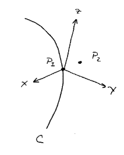
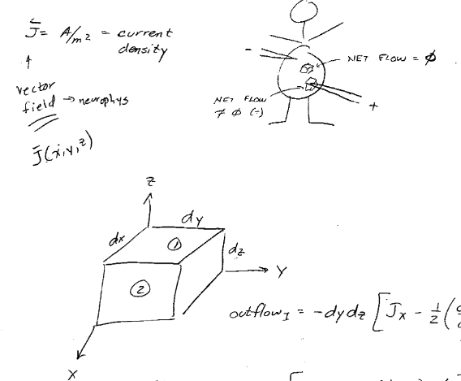

# Bioelectric Phenomena
*Source: BME 471 — Bioelectric Phenomena, Prof. Moran*

## Electromagnetic (EM) Theory

In a biological environment, most systems are not **linear time-invariant systems (LTI systems)**. We use **circuit theory**, a subset of EM theory, to help understand these biological systems. Circuit theory offers the following benefits:

* Lumped parameters
* Less complicated
* Accurate

However, there are some requirements for circuit theory to be a valid replacement for EM theory:

### 1) Speed \\( \gg \\) dimensions

\\( c = 3 \times 10^8 \\) m/s

The speed of electricity in a wire is \\( 1 \times 10^8 \\) m/s; however, electrons themselves move at only \\( 0.5 \\) mm/s for 15 A on #14 AWG wire.

Nerve conduction (ionic current, relatively slow): 1-10 m/s in unmyelinated nerves and 10-100 m/s in myelinated nerves.

### 2) Wavelength \\( \gg \\) dimensions

a) 60 Hz power: \\( \lambda = c/f = (3 \times 10^8 \text{ m/s}) / (60 \text{ cycles/s}) \approx 3100 \text{ miles} \\)

b) AM radio tower: \\( \lambda = 300 \\) m, quarter-wavelength = 100 m

c) Nerve action potential: \\( \lambda = (10 \text{ m/s})(1 \text{ ms}) = 1 \text{ cm} \\)

Neither the speed nor the wavelength condition is satisfied here, so circuit theory in general does not work.

## Field and Wave Electromagnetics

### Field Quantities

| Symbol | Quantity | Units |
|---|---|---|
| \\( \vec{E} \\) | Electric Field Intensity | V/m |
| \\( \vec{D} \\) | Electric Flux Density | C/m² = A·s/m² |
| \\( \vec{B} \\) | Magnetic Flux Density | V·s/m² = Tesla |
| \\( \vec{H} \\) | Magnetic Field Intensity | A/m |

### Unit Definitions

* F (farad) = A·s/V = C/V
* H (henry) = V·s/A

### Constants

| Symbol | Meaning | Value |
|---|---|---|
| \\( c \\) | speed of light | \\( 3 \times 10^8 \\) m/s |
| \\( \epsilon_0 \\) | permittivity of free space | \\( 10^{-9}/(36\pi) \\) F/m |
| \\( \mu_0 \\) | permeability of free space | \\( 4\pi \times 10^{-7} \\) H/m |

### Constitutive Relations

\\[ \vec{D} = \epsilon_0 \vec{E} \\]

\\[ \vec{B} = \mu_0 \vec{H} \\]

\\[ c = \frac{1}{\sqrt{\epsilon_0 \mu_0}} \\]

**Takeaway: there is no inductance in the body — only resistance and capacitance exist.**

## Fields

a) Scalar field: \\( A(x, y, z) \\) - could be a function of time

b) Vector field: \\( [A_x, A_y, A_z](x, y, z) \\) - could be a function of time

### A) Gradient

Let \\( \phi(x, y, z) \\) be a scalar field. Define a surface C by \\( \phi(x, y, z) = \text{constant} \\) (e.g., contour lines on a map).

Let \\( P_1 = (x, y, z) \\) and \\( P_2 = (x + dx,\ y + dy,\ z + dz) \\), so that:

\\[ \vec{P_2} - \vec{P_1} = d\vec{l} \\]

\\[ d\vec{l} = \vec{a_x}\,dx + \vec{a_y}\,dy + \vec{a_z}\,dz \\]

The difference in potential from \\( P_1 \\) to \\( P_2 \\) is the total derivative of \\( \phi(x, y, z) \\), evaluated at \\( P_1 \\). By the chain rule:

\\[ d\phi = \frac{\partial \phi}{\partial x}dx + \frac{\partial \phi}{\partial y}dy + \frac{\partial \phi}{\partial z}dz \\]

We define the gradient vector \\( \vec{G} \\):

\\[ \vec{G} \equiv \frac{\partial \phi}{\partial x}\vec{a_x} + \frac{\partial \phi}{\partial y}\vec{a_y} + \frac{\partial \phi}{\partial z}\vec{a_z} \\]

Thus:

\\[ d\phi = \vec{G} \cdot d\vec{l} \\]

Note that if \\( P_2 \\) lies on surface C:

a) \\( d\vec{l} \\) is tangent to C at \\( P_1 \\)

b) \\( d\phi = 0 \\) since \\( \phi \\) is constant on C

c) \\( \therefore\ d\vec{l} \\) is orthogonal to \\( \vec{G} \\)

d) and \\( \vec{G} \\) is \\( \perp \\) (perpendicular) to surface C

Equivalently, in terms of the angle \\( \theta \\) between \\( d\vec{l} \\) and \\( \vec{G} \\):

\\[ d\phi = d\vec{l} \cdot \vec{G} = G\cdot dl\cos\theta \\]

\\[ \frac{d\phi}{dl} = G\cos\theta, \qquad \text{when } \theta = 0,\ \frac{d\phi}{dl} = \max \\]

**Gradient** = the maximum rate of increase in \\( \phi \\), and is normal to the equipotential surface.

**Del operator:**

\\[ \nabla \equiv \vec{a_x}\frac{\partial}{\partial x} + \vec{a_y}\frac{\partial}{\partial y} + \vec{a_z}\frac{\partial}{\partial z} \\]

*Example:* taking the gradient of elevation points (a scalar field) on a mountain.
* Direction points in the steepest direction.
* Magnitude gives the slope.

- Water flows fastest in the negative-gradient direction of a hill; flow is proportional to the negative gradient.
- The same is true for currents in the body: currents flow in the negative gradient of potential.

### B) Divergence — finding sources and sinks

Let \\( \vec{J} \\) (units \\( A/m^2 \\)) be the current density — a vector field relevant to neurophysiology: \\( \vec{J}(x, y, z) \\).

A point where the net outward flow is zero has no source or sink; a nonzero net flow indicates a source (net flow \\( > 0 \\)) or a sink (net flow \\( < 0 \\)).

For a small volume element with sides \\( dx, dy, dz \\), consider the outflow through the two faces normal to \\( x \\):

\\[ \text{outflow}_1 = -dy\,dz\left[J_x - \frac{1}{2}\left(\frac{\partial J_x}{\partial x}\right)dx\right] \\]

\\[ \text{outflow}_2 = dy\,dz\left[J_x + \frac{1}{2}\left(\frac{\partial J_x}{\partial x}\right)dx\right] + \text{H.O.T.} \\]

Summing the outflow over all six surfaces of the volume element:

\\[ \oint_S \vec{J} \cdot d\vec{S} = \left(\frac{\partial J_x}{\partial x} + \frac{\partial J_y}{\partial y} + \frac{\partial J_z}{\partial z}\right)dx\,dy\,dz \\]

Dividing by \\( dx\,dy\,dz \\):

\\[ \text{div}\,\vec{J} = \lim_{V \to 0} \frac{\oint_S \vec{J} \cdot d\vec{S}}{V} \\]

\\[ \text{div}\,\vec{J} = \frac{\partial J_x}{\partial x} + \frac{\partial J_y}{\partial y} + \frac{\partial J_z}{\partial z} = \nabla \cdot \vec{J} \\]

### C) Laplacian

- The gradient of a scalar field is a vector field.
- The divergence of a vector field is a scalar field.

\\[ \nabla^2 \psi = \nabla \cdot \nabla \psi \\]

\\[ \nabla \psi = \vec{a_x}\frac{\partial \psi}{\partial x} + \vec{a_y}\frac{\partial \psi}{\partial y} + \vec{a_z}\frac{\partial \psi}{\partial z} \\]

\\[ \nabla \cdot \nabla \psi = \frac{\partial}{\partial x}\left(\frac{\partial \psi}{\partial x}\right) + \frac{\partial}{\partial y}\left(\frac{\partial \psi}{\partial y}\right) + \frac{\partial}{\partial z}\left(\frac{\partial \psi}{\partial z}\right) = \frac{\partial^2 \psi}{\partial x^2} + \frac{\partial^2 \psi}{\partial y^2} + \frac{\partial^2 \psi}{\partial z^2} \\]

The Laplacian of a flow function identifies the presence and magnitude of a source or sink in that flow.
